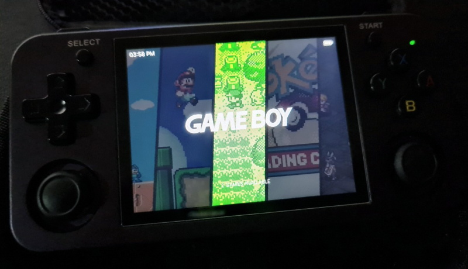

# arkos-es-art-book-next-4x3

Before to begin, thanks to; 

> previous version: https://github.com/ljhmd0825/Arkos-43-art-book-next

## Introduction

The stock os for rg353m was very glitchy so i decided switch to ArkOS and no themes were complete for my preference.

This version of the theme is for ArkOS Emulationstation-FCAMOD frontend on 640x480 resolution. More specifically it was worked on rg353m model. i didn't have enough time to  super-fine-tune the numbers of the elements but they should look just as good. 

A lot of firmwares are already comes with art-book-next theme but some are yet not. If you like this variant and does not come with art-book-next theme, then there is a good chance that this theme would work for the devices (other than rg353m) if it has screen ratio of 4x3 with Emulationstation as the frontend espeically if the resolution is 640x480. 

I have tested this theme on stock OS (older version of batocera) and it works into some degrees but battery indicator didn't work at all. Everything else seemed fine except that. 

## Preview 

I do not own a capture card so i couldn't take the screenshot so this is the best i can do. i was working through ssh and was hoping to be able to take screenshots but scrot would not work because the frontend is not x-window ofc. 

you can see there is an transparent layer between system logo and carousel. the default contrast between the selected systems was not enough for my likings. the extra layer really made the selected system image to stand out than the others and more interesting to slide it through. you can remove the contrast layer, set bezels or change the opacity of the layer in the theme options. 

 

## Changes from previous theme

I added and modified few things here and there. some of the changes are as follow;

* Added new transparent layer in system-multi view for better contrast and option to select the contrast ratio in `Theme Configuration -> Overlay Transparency`.
    - Medium (default) 
    - Light
    - Very Light
    - Dark 
    - Very Dark
* The bezel options you can choose in `Theme Configuration -> System select Overlay`; 
    - Side bezel
    - All-side bezel
    - No bezel 
    - No overlay
* Moved clock to top left and adjusted cordinate
* Moved battery indiciator to top right and adjusted cordinate
* Changed battery indiciator to frontend default and added spacing between icon and text
* Added option to select system images between default and custom in `Theme Configuration -> System View: Image`. You can change theme also.
    - Added custom system images;
        - __nes__: *mega man 3*
        - __gb__: *pokemon yellow*
        - __gbc__: *pokemon trading card game*
        - __gba__: *final fantasy tactics advance*
        - __neogeo__: *kof98*
        - __satern__: *castleveina symphony of the night*
        - __nds__: *professor layton curious village*
        - __psx__: *valkyrie profile*
        - __psp__: *monster hunter portable 3rd*
        - __mame__: *arcade pixel art from [Link](https://www.reddit.com/r/readyplayerone/comments/116gill/i_drew_this_pixel_art_of_an_old_arcade_and_called/)*
        - __last-played__: *bookshelf pixel art from [Link](https://www.reddit.com/r/PixelArt/comments/11m1fcp/bookshelf/)*

## Sidenote (Disclaimer)

You do not need to read this unless you want to edit the theme for yourself but here is the list of my findings for the future just in case if i want to come back and add more stuff.

 -  WiFi Indicator could not be displayed on the versions of the frontend of my device. The only way to check the WiFi connection was through the main menu. I do not own devices other than rg353m so i could not check. 

-  variable elements can't be re-assigend with other value once it is assigned. 

-  variable elements can't be concatinated with other variable elements itself

-  game count on screen is hardcoded, had to find a workaround [Link](https://retropie.org.uk/forum/topic/23252/emulationstation-theme-systeminfo). the version of the EmulationStation does not allow condition checks such as `IfSubset`.

-  `batteryIndiciator` element would not work with alignment. therefore the element will render based on coordinate of left corner of the element. this ends up making 'icon with text' near impoosible to position it perfectly on top-right on the screen as the width of percentage text increases or decreases per remaining battery. the soluttion was to pushing out the batteryIndiciator text out of the screen.  

## **Acknowledgments**
* Previous version from: https://github.com/ljhmd0825/Arkos-43-art-book-next
* Original theme : https://github.com/anthonycaccese/art-book-next-jelos
* Referenced Theme :  https://github.com/nkahoang/es-theme-art-book-next-arkos
* Referenced Theme :  https://github.com/Jetup13/es-theme-sagaartbook
* Most system logos were sourced and modified from the excellent work done by Dan Patrick [here](https://archive.org/details/console-logos-professionally-redrawn-plus-official-versions).  I modified each to be compatible with EmulationStation's current SVG support.
* ChangaOne font is by [Eduardo Tunni](https://www.fontsquirrel.com/fonts/changa)
* Oxygen font is by [Vernon Adams](https://www.fontsquirrel.com/fonts/oxygen)
* Auto-Collection Genre background art created by [@nautipuss](https://github.com/nautipuss)
* Metadata Icons sourced from [FontAwesome](https://fontawesome.com/search?o=r&m=free)

## **License**
(Attribution back to the OG repo by `anthonycaccese`: https://github.com/anthonycaccese/art-book-next-es)
Creative Commons CC-BY-NC-SA - https://creativecommons.org/licenses/by-nc-sa/2.0/
You are free to share and adapt this theme as long as you provide attribution back to me (and the above credits) as well share any updates you make under the same licence terms.
